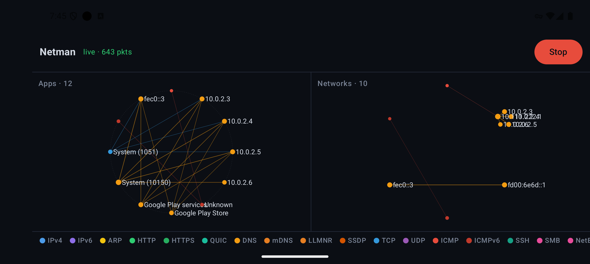

# Netman Reborn — Android (Appman + Interman)

A standalone Android port of Netman Reborn: a **passive** network monitor for
your own device, captured through Android's `VpnService` — no root. Two live
panels, native Jetpack Compose, fed by a **single capture**, and adaptive
across phone / foldable / tablet.

Because a device VPN sees IP packets and not Ethernet frames, the layer-2
**Etherman** view has no equivalent here. Its slot is taken by **Appman**: one
node per Android application (with its name from `PackageManager`), edged to the
remote hosts it talks to — the same question the 1993 Etherman answered ("who is
talking to whom"), translated to the only vantage point an unrooted phone has.
The **Interman** (layer-3, IPv4+IPv6) view is unchanged in spirit.



## What it is (and is not)

- **Strictly passive**: it captures and displays. Nothing is injected — same
  ethics rules as the desktop tool (CLAUDE.md §3).
- A VPN app **must carry** the traffic it sees, or the device goes offline. So
  the app contains a userspace TCP/UDP forwarding engine (Rust, `ipstack`) that
  relays every flow to a real, `protect()`-ed socket. This is the one place the
  "native capture, never virtualized" invariant (§3) is deliberately relaxed:
  on an unrooted phone a `VpnService` tun **is** the only capture point.
- **Own-device traffic only.** A VPN sees this device's packets, not the
  neighbours'. To watch a whole segment, use the desktop build on a SPAN port.

## How it reuses the desktop core

The aggregation tables, the delta protocol (`wsproto`), reverse-DNS, and the
250 ms tick loop are the **same Rust code** as the desktop binary. The port
adds:

- `parse_ip_packet` (raw IP, no Ethernet) beside `parse_frame`;
- a third view, `View::App`, in the frozen delta contract (the web client
  ignores unknown views — same-commit rule honoured);
- `android/rust/netman-android`, a `cdylib` that reads the tun fd, runs the
  forwarding engine, and delivers the exact same JSON deltas to Kotlin through a
  UniFFI callback instead of a WebSocket.

```
VpnService tun fd ─▶ Rust: tun-read thread ─┬─▶ parse_ip_packet ─▶ agg loop ─▶ deltas (JSON)
                                             └─▶ ipstack forwarding (protected sockets)
Kotlin callbacks: onDeltas / protectSocket / lookupUid (getConnectionOwnerUid) / resolveApp
        └─ Channel ─▶ single main-thread reducer ─▶ GraphStore ×2 ─▶ Compose
```

## Requirements

- **Android 10 (API 29)+** — `ConnectivityManager.getConnectionOwnerUid`, used
  for per-app attribution, is API 29.
- Build host: **JDK 17+**, the **Android SDK** (platform 36, NDK 29), **Rust**
  (stable) with the Android targets, and **cargo-ndk**:

  ```sh
  rustup target add aarch64-linux-android x86_64-linux-android
  cargo install cargo-ndk
  export ANDROID_NDK_HOME=$ANDROID_HOME/ndk/<version>   # e.g. 29.0.14206865
  ```

## Build & run

From `android/` (a self-contained Gradle project):

```sh
./gradlew :app:assembleDebug      # builds the Rust .so (both ABIs) + UniFFI
                                  # bindings, then the APK
./gradlew :app:installDebug       # install on a connected device/emulator
```

The Gradle build drives Rust automatically via two tasks — `cargoNdkBuild`
(cross-compiles the cdylib) and `generateUniffiBindings` (library-mode Kotlin
bindings). Pass `-PskipRust` to reuse the previous Rust outputs for fast UI
iteration.

Open the app, tap **Start**, accept the VPN consent dialog, and the two panels
fill with your live traffic. Tap **Stop** (or the notification action) to end
capture. The capture is a foreground service: it keeps running with the UI
closed and resynchronises when you reopen it.

## Tests

```sh
# Rust core (host, no device): parsing, App aggregation, full session over a pipe
cargo test -p netman-android
cargo test --workspace                     # from the repo root

# Kotlin: reducer, layouts, rates, visual mapping, panel projection
./gradlew :app:testDebugUnitTest

# Compose UI tests (needs a device/emulator)
./gradlew :app:connectedDebugAndroidTest
```

Compose `@Preview`s for every screen (phone / foldable / tablet / desktop) live
in `ui/Previews.kt`.

## Layout of this directory

```
android/
├── app/                         # the Compose application
│   ├── build.gradle.kts         # AGP + cargo-ndk / uniffi-bindgen wiring
│   └── src/main/java/dev/jpcottin/netman/
│       ├── core/                # UniFFI bridge, delta protocol, reducer
│       ├── graph/               # GraphStore + ports of app.js (layout/rates/visual)
│       ├── vpn/                 # VpnService, controller, state
│       ├── attribution/         # uid → app label/icon
│       └── ui/                  # adaptive screen, panels, legend, previews
└── rust/netman-android/         # the cdylib: tun reader, forwarding, FFI
```

## Status

Working and demonstrated on-device: the VPN captures and forwards (the phone
browses normally), deltas render live, and flows are attributed to real apps
(Google Play services, System, …) with an *Unknown* bucket for what
`getConnectionOwnerUid` can't resolve.

Both panels render as **live Canvas graphs** — the circular Appman layout and
the per-network Interman rings, with colored nodes/edges, guide circles,
ease-out-cubic animation, pinch-zoom/pan, and tap-to-select (a card shows the
node's in/out bytes). A **Graph ⇄ List** toggle in the top bar switches each
panel to a sorted node list. The layout math (`graph/Layouts.kt`), rates
(`graph/Rates.kt`) and visual mapping (`graph/Visual.kt`) are ports of the web
frontend, unit-tested on the JVM.

Refinements still open: per-edge rate EWMA (edges currently scale by cumulative
bytes, not smoothed rate), label decluttering when a network cluster is dense,
a protocol-highlight filter, and app icons on Appman nodes (letter-disc
fallback is in place). The custom launcher icon is a node-graph motif in the
netman palette.
